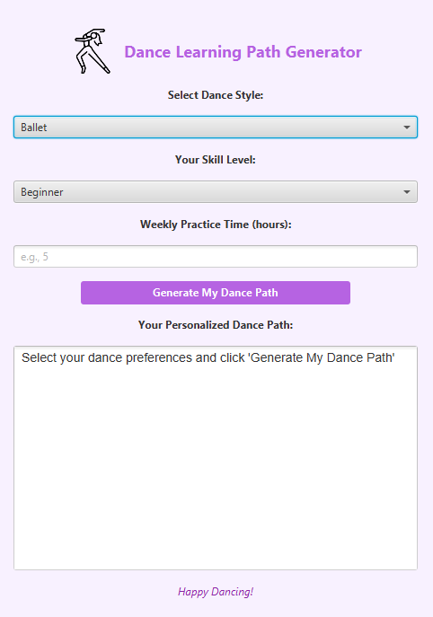

# Personalized Dance Learning Path Generator
A Java application that generates personalized dance learning paths based on user goal genre, skill level, and available time.

This is a personal/individual project to strengthen my skills in Java, algorithms, sql, and UI generation.

## Setup
1. Install JDK 17.
2. Open in IntelliJ IDEA.
3. Ensure Maven downloads dependencies (sqlite-jdbc, JUnit).
4. Run `Main.java` to start the JavaFX app.

## Features
- Choose genre/style, skill level, and weekly hours.
- Generates a learning path with curated YouTube resources.

## Sample Screen

